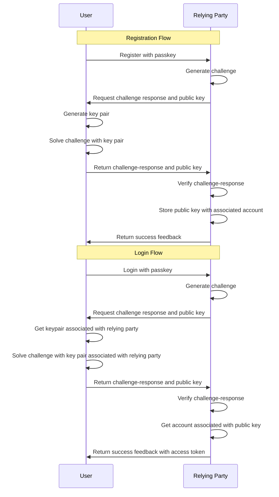

# Docs

## Authentication

### Passkeys

Back when there were 2 or 3 apps on the internet, passwords were a significant technological acheivement that enabled internet users to authenticate in the most usable and cost-effective way possible. That being said, the internet is more than 30 years old now and, on average, an internet user has around 191 passwords to remember. If they are to do things by the book, that means 191 unique and complex (difficult to crack) passwords that they need to remember.

Ofcourse, this is not the case. Most people use the same password for multiple accounts, and some even use the same password for all their accounts. Best case scenario, they use a password manager.

> [!Warning]
> Passkeys alone are not a silver bullet. They are a significant improvement over passwords but they are not perfect. You still need to be careful about how you manage your keys and you ought to leverage multi-factor authentication incase your keys are compromised.

The new thing on the block is Passkeys which allows users to authenticate using public key encryption instead. The way that it works is that, for every website (relying party) that you want to use, a key pair is generated and the public key is stored by the relying party and used to challenge you when you authenticate. As of 2025, Passkeys have been adopted and supported by the most common browsers and websites.

#### Implementation

The personal website currently uses passwords which means that, when implmenting Passkeys, we will need to consider how to support both passwords and Passkeys.

Some flows to consider:

- registration
  - add multiple passkeys to an account
  - remove multiple passkeys from an existing account
  - add a password to a new account
  - change a password for an existing account
- login
  - authenticate using a passkey
  - authenticate using a password

